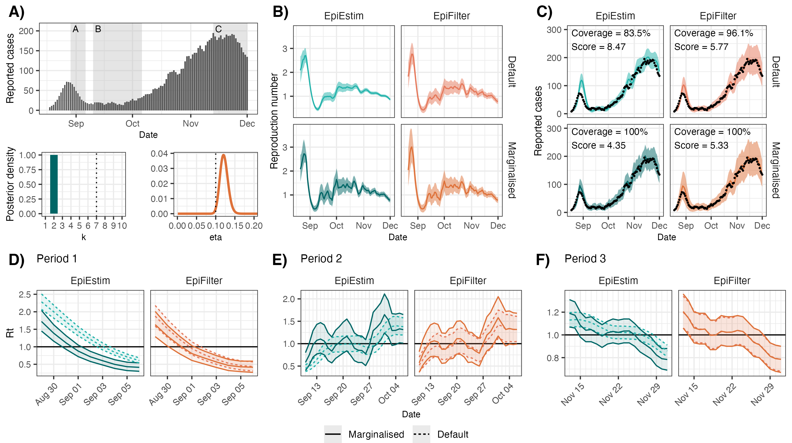

# Robust uncertainty quantification in popular estimators of the instantaneous reproduction number

This repository contains the code and data for the paper "*Robust uncertainty quantification in popular estimators of the instantaneous reproduction number*".

All source code is written in Julia. Example code in the form of Jupyter notebooks is also provided. Finally, R scripts are used to generate the figures in the paper.

Other than a [Julia installation](https://julialang.org/downloads/), no external software is required to run this code. Simply clone this repository, open a Julia terminal in the main directory, and copy-paste the example code snippets. [We recommend starting with EpiEstim here](https://github.com/nicsteyn2/EpiFilterFittingPublic/blob/main/EpiEstim.ipynb).

### Structure of this repository:

- `/data/`: Contains the data used in the paper and example scripts.
- `/paper/`: Contains the code to generate and plot results in the paper and supplementary material.
- `/src/`: Source code providing simple implementations of our methods, as well as helper functions to load data etc.
- `EpiEstim.ipynb`: Jupyter notebook with example code for fitting EpiEstim.
- `EpiFilter.ipynb`: Jupyter notebook with example code for fitting EpiFilter.

### Example results:

